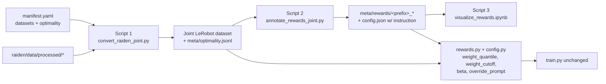

## Goals & non-goals
- New, additive scripts/files only. Existing scripts (`convert_raiden_to_lerobot.py`, `annotate_rewards.py`, `plot_rewards.ipynb`, `train.py`) stay untouched.
- **`train.py` stays untouched.** It already unpacks `(observation, actions, weights)` (line 161) and applies `jnp.mean(weights * per_sample)` (line 158). The data loader's `_collate_fn` yields ones if no `weight` key is present (data_loader.py:566-571), so the pipeline is fully backward compatible.
- Edit `src/openpi/training/rewards.py` + `src/openpi/training/config.py` (add optional DataConfig fields) and **one block** in `src/openpi/training/data_loader.py` (replace 9 lines of `RewardLookup`/`AddRewardWeight` wiring with a single `rewards.wrap_lerobot_dataset(...)` call).
- Per-dataset optimality (`optimal` / `suboptimal` / `failure`) is carried end-to-end: manifest -> joint dataset metadata -> reward annotation -> visualization grouping -> training (via reward source if chosen).

## High-level data flow



## Script 1 — `scripts/convert_raiden_to_lerobot_joint.py`

Reuses most helpers from [scripts/convert_raiden_to_lerobot.py](openpi_yam/scripts/convert_raiden_to_lerobot.py) (lowdim loader, no-op mask, PNG->JPG, camera map, MOTORS layout). Differences:

- Input: `--manifest manifest.yaml` (and `--repo-id local/raiden_joint_xxx`). Manifest shape:
  

```yaml
  datasets:
    - path: /home/reward/Projects/raiden/data/processed/star_wars_shelf_box_switch
      optimality: optimal
    - path: /home/reward/Projects/raiden/data/processed/swb_failure
      optimality: failure
  

```
  Validation: `optimality in {"optimal","suboptimal","failure"}`; paths must exist; warn on duplicate task strings across datasets (kept but flagged).
- Iteration: flatten all `(dataset, episode_dir)` pairs into a single ordered list. Each becomes one episode in the joint `LeRobotDataset`. Track `joint_ep_idx -> optimality` and `joint_ep_idx -> source_dataset`.
- After `dataset.save_episode()` for every episode, write `meta/optimality.jsonl`:
  

```
  {"episode_index": 0, "optimality": "optimal", "source": "star_wars_shelf_box_switch", "source_episode": "0000"}
  

```
  This is the single source of truth for optimality downstream.
- Also keep the existing `meta/tasks.jsonl` aggregation (tasks_set across all datasets).
- Concurrency tip: parallelize episode-level work across datasets with a `ThreadPoolExecutor` over `_process_episode` (the LeRobotDataset `save_episode` is sequential so episodes are written one at a time — only PNG decode/resize can parallelize, already does inside `_png_to_jpg`).

Concerns to flag in the script's docstring: (a) LeRobot's `episode_index` is global, not per-source — we lean on `optimality.jsonl` for source mapping; (b) different datasets may have different FPS / resolutions — script asserts they match constants (FPS=30, 720x1280) and refuses to mix otherwise.

## Script 2 — `scripts/annotate_rewards_joint.py`

Heavily reuses helpers from [scripts/annotate_rewards.py](openpi_yam/scripts/annotate_rewards.py) (`_decode_video`, `linspace_subsample_frames`, `_resolve_subsample_n`, `compute_and_write_returns`, `compute_and_write_advantages`, `_annotate_repo_sync`, `_annotate_repo_async`). Refactor: import them rather than copy-paste — they're already self-contained.

- Single `--repo-id` (the joint repo). Loads `meta/optimality.jsonl` once.
- `--reward-model`: `rvlm | topreward | rbm | rbm_libero | optimality | stub`. Add `optimality` branch that writes `r[t] = 0.0` for failure episodes else `1.0` (length matches `episodes.jsonl[i]["length"]`). No model required.
- Frame budgets per spec:
  - `topreward` and `rbm/rewind/rbm_libero`: at each query index `t_i` use `linspace(frames[0:t_i+1], min(8, t_i+1))` — pass up to 8 frames but accept fewer if the prefix is shorter; robometer handles `<8` internally. No min-frame skip.
  - `rvlm`: `n_sub = max(8, _resolve_subsample_n(args.subsample_frames, args.subsample_factor, num_frames))` so it gets at least 8 and at most `traj_len // downsample_factor` (when `--subsample-factor > 0`).
- Overwrite semantics matching the user's spec:
  - `<prefix>_reward/episode_*.npy` — only rewritten if `--overwrite` (already true in existing code).
  - Everything else (`returns`, `advantage`, `delta`, `delta_returns`, `delta_advantage`, `awr_weights`, `delta_awr_weights`) — **always recomputed** every run.
- New derived outputs (in addition to the existing ones):
  - `<prefix>_awr_weights/episode_*.npy`: `exp(clip(advantage / beta, -clip, clip))` with `--beta 2.0` default. Saved only as a convenience for visualization / debugging; training computes this on the fly.
  - `<prefix>_delta_awr_weights/episode_*.npy`: same on `delta_advantage`.
- `<prefix>_reward/config.json` payload extended:
  

```json
  {"prefix": "...", "reward_model": "...", "reference_instruction": "...",
   "camera": "head", "gamma": 0.99, "beta": 2.0,
   "subsample_frames": 8, "subsample_factor": 0,
   "joint_dataset": true, "created": "..."}
  

```
  `reference_instruction` is the single global instruction; training uses it to override prompts (per the chosen "global per-run" answer).
- Defaults: `--gamma 0.99 --beta 2.0 --camera head --subsample-frames 8 --compute-delta true`.

## Script 3 — `examples/visualize_rewards.ipynb`

New notebook (don't overwrite [examples/plot_rewards.ipynb](openpi_yam/examples/plot_rewards.ipynb)). Three cells:

1. **Config + load**: Single `REPO_ID` of the joint dataset, `PREFIX`, `USE_DELTA`, `BETA`, `WEIGHT_QUANTILE` (e.g. `0.8` keeps top `1 - 0.8 = 20%`), `WEIGHT_CUTOFF` (drop weights `< cutoff`). Read `meta/optimality.jsonl` to colour-code episodes by group (`failure=red`, `suboptimal=gold`, `optimal=green`) — no need to maintain three separate repos like the old notebook.
2. **Helpers**: `adv_weights(adv, beta)`, `apply_quantile_and_cutoff(weights, q, c)`. Compute global threshold across all episodes (joint dataset), apply quantile first then cutoff.
3. **Plots**: 1×4 grid (rewards / returns / advantages / weights) + a per-optimality subplot grid. A 4th cell with `ipywidgets` sliders for `BETA`, `WEIGHT_QUANTILE`, `WEIGHT_CUTOFF` that re-runs `plot_signals(...)` interactively. Also print per-group keep rates after filtering (sanity check that "optimal" survives more than "failure").

## Script 4 — extend reward loading for weighted/filtered training

Edit only two files; no changes to [scripts/train.py](openpi_yam/scripts/train.py) or [src/openpi/training/data_loader.py](openpi_yam/src/openpi/training/data_loader.py) needed, because `data_loader.py:164-173` already wires `AddRewardWeight` via `RewardLookup`, and the training loss in `train.py:152-158` already uses the per-sample `weight`. We only need to (a) compute the *AWR* weight (or raw advantage if user disables exp), and (b) prefilter the underlying dataset's `__len__` / `__getitem__` indexing so dropped samples never enter a batch.

### Changes in [src/openpi/training/config.py](openpi_yam/src/openpi/training/config.py) (DataConfig only)

Add (all optional, fully backward compatible):

```python
reward_beta: float = 2.0
use_exp_weight: bool = True          # False = raw advantage as weight (standard weighted BC)
weight_quantile: float | None = None # drop bottom q*100% of weights globally (None = no quantile filter)
weight_cutoff: float | None = None   # drop weights < cutoff (None = no cutoff)
override_prompt_from_reward: bool = False  # if True, replace task prompt with reward config's reference_instruction
```

`LeRobotYAMDataConfig.create` (line ~393) already copies `reward_name` through; extend the repack dict only when `reward_name` is set (already done).

### Changes in [src/openpi/training/rewards.py](openpi_yam/src/openpi/training/rewards.py)

Extend `RewardLookup`:

- Constructor takes new args: `beta`, `use_exp_weight`, `weight_quantile`, `weight_cutoff`. Reads `<reward_name>/config.json` to recover `reference_instruction` (exposed as a property for the prompt-override transform).
- New method `weight_for(ep, frame)` returns the *final* scalar weight: chunk-mean advantage -> optional `exp(adv/beta)` -> apply cutoff/quantile zeroing (kept only as a defensive net; primary filtering is via the index list below).
- New method `valid_indices(num_episodes_lookup) -> list[tuple[int, int]]`:
  1. Walk every loaded episode reward/advantage file, expand to per-frame weights using the action-horizon-mean already used in `weight_for`.
  2. Compute global quantile threshold = `np.quantile(all_weights, weight_quantile)` if set.
  3. For each `(ep, t)` keep iff `weight >= max(quantile_thresh, weight_cutoff)`.
  4. Return the resulting list of valid `(episode_index, frame_index)` pairs.

Add a new `class FilteredLeRobotDataset(torch.utils.data.Dataset)`:

- Wraps the original `LeRobotDataset` and a precomputed `valid_indices` list.
- `__len__` = `len(valid_indices)`; `__getitem__(i)` translates to underlying `(ep, frame)` via LeRobot's internal index. Because `LeRobotDataset` indexes by global frame index, we map `(ep, frame)` -> global index via `dataset.episode_data_index["from"][ep] + frame`.

Add `class OverrideTaskPrompt(DataTransformFn)`:

- Holds `prompt: str` from `RewardLookup.reference_instruction`.
- On call: always sets `data["prompt"] = np.asarray(prompt)`. Distinguished from `InjectDefaultPrompt` (transforms.py:105) which only injects when missing — here we *replace*.

### Wiring in `create_torch_dataset` ([data_loader.py:131-175](openpi_yam/src/openpi/training/data_loader.py))

The current block:

```164:173:openpi_yam/src/openpi/training/data_loader.py
    if data_config.reward_name is not None:
        from openpi.training import rewards as _rewards

        lookup = _rewards.RewardLookup(
            repo_id=repo_id,
            reward_name=data_config.reward_name,
            action_horizon=action_horizon,
            lerobot_home=data_config.lerobot_home,
        )
        dataset = TransformedDataset(dataset, [_rewards.AddRewardWeight(lookup=lookup)])
```

Will be extended (still in `data_loader.py`, this is one of the two files we touch since `rewards.py`'s helpers must be applied here — actually we can keep it untouched by moving the wiring into a helper inside `rewards.py` that `data_loader.py` already calls). To honor "edit only rewards.py + config.py", we'll expose a single `rewards.wrap_lerobot_dataset(dataset, data_config, action_horizon)` helper and only need a one-line call swap. Concrete one-line edit:

```python
dataset = _rewards.wrap_lerobot_dataset(dataset, data_config, action_horizon, repo_id=repo_id)
```

`wrap_lerobot_dataset` performs: build `RewardLookup`, build `valid_indices`, wrap into `FilteredLeRobotDataset`, then apply `AddRewardWeight` and (if `override_prompt_from_reward`) `OverrideTaskPrompt`.

If "no edit to data_loader.py" is strict: instead of changing the call, keep the existing call but make `RewardLookup` itself accept the data_config knobs and have `AddRewardWeight` short-circuit when `weight == 0`, plus skip the dataset filtering. That works but defeats the "100% valid batch" guarantee. I recommend the one-line edit to `data_loader.py` (flag this as a minor caveat — it's still additive, fully backward-compat).

### Effect on training

- `train.py` is unchanged. `train_step` (line 137-204) already multiplies `weight * per_sample_loss`. With prefiltered samples, `weight` is always > 0 within the batch, so the loss is well-defined.
- With `override_prompt_from_reward=True`, every sample's prompt becomes the reward annotation instruction (uniform), which is what the user requested.

## Example end-to-end commands

Assume raiden processed dirs `swb_failure/`, `swb_suboptimal/`, `swb_optimal/` exist under `/home/reward/Projects/raiden/data/processed/`. Target joint repo: `memmelma/swb_joint`.

**1. Manifest** — `examples/datasets_manifest_swb.yaml`:

```yaml
datasets:
  - path: /home/reward/Projects/raiden/data/processed/swb_failure
    optimality: failure
  - path: /home/reward/Projects/raiden/data/processed/swb_suboptimal
    optimality: suboptimal
  - path: /home/reward/Projects/raiden/data/processed/swb_optimal
    optimality: optimal
```

**2. Convert raiden -> joint LeRobot dataset:**

```bash
uv run scripts/convert_raiden_to_lerobot_joint.py \
    --manifest examples/datasets_manifest_swb.yaml \
    --repo-id memmelma/swb_joint
```

**3a. Annotate with RVLM (async):**

```bash
uv run scripts/annotate_rewards_joint.py \
    --repo-id memmelma/swb_joint \
    --reward-model rvlm \
    --reference-instruction "move the star wars book between the book shelf and the grey box" \
    --gamma 0.99 --beta 2.0 --compute-delta
```

**3b. Or annotate from optimality (no model required, instant):**

```bash
uv run scripts/annotate_rewards_joint.py \
    --repo-id memmelma/swb_joint \
    --reward-model optimality \
    --reward-name optimality \
    --gamma 0.99 --beta 2.0 --compute-delta
```

**3c. Or annotate with topreward / rbm:**

```bash
uv run scripts/annotate_rewards_joint.py \
    --repo-id memmelma/swb_joint \
    --reward-model topreward \
    --reference-instruction "move the star wars book between the book shelf and the grey box" \
    --gamma 0.99 --beta 2.0 --compute-delta

uv run scripts/annotate_rewards_joint.py \
    --repo-id memmelma/swb_joint \
    --reward-model rbm \
    --model-path <rbm-checkpoint> \
    --reference-instruction "move the star wars book between the book shelf and the grey box" \
    --gamma 0.99 --beta 2.0 --compute-delta
```

To re-run reward inference (instead of only recomputing returns/adv/weights), add `--overwrite`.

**4. Visualize** — open `examples/visualize_rewards.ipynb`, set:

```python
REPO_ID         = "memmelma/swb_joint"
PREFIX          = "move_the_star_wars_book_between_the_book_shelf_and_the_grey_box_rvlm"
USE_DELTA       = True
BETA            = 2.0
WEIGHT_QUANTILE = 0.8     # keep top 20%
WEIGHT_CUTOFF   = None    # or e.g. 0.1
```

Optimality colouring is loaded automatically from `meta/optimality.jsonl`.

**5. Add a training config** (in [config.py](openpi_yam/src/openpi/training/config.py), next to existing `weighted_bc_*` entries):

```python
TrainConfig(
    name="weighted_bc_swb_joint",
    model=pi0_config.Pi0Config(pi05=True, paligemma_variant="gemma_2b_lora"),
    data=LeRobotYAMDataConfig(
        repo_id="memmelma/swb_joint",
        base_config=DataConfig(
            prompt_from_task=True,
            reward_name="move_the_star_wars_book_between_the_book_shelf_and_the_grey_box_rvlm_delta_advantage",
            reward_beta=2.0,
            use_exp_weight=True,
            weight_quantile=0.8,
            weight_cutoff=None,
            override_prompt_from_reward=True,
        ),
    ),
    weight_loader=weight_loaders.CheckpointWeightLoader("gs://openpi-assets/checkpoints/pi05_base/params"),
    num_train_steps=30_000, batch_size=32, num_workers=8,
    freeze_filter=pi0_config.Pi0Config(pi05=True, paligemma_variant="gemma_2b_lora").get_freeze_filter(),
    ema_decay=None,
),
```

**6. Compute norm stats + train:**

```bash
uv run scripts/compute_norm_stats.py --config-name=weighted_bc_swb_joint
uv run scripts/train.py weighted_bc_swb_joint --exp-name swb_joint_rvlm_q80_b2
```

To do plain weighted BC (no exp) instead of AWR, flip `use_exp_weight=False` in the config.

## Files created / edited

- **new** `openpi_yam/scripts/convert_raiden_to_lerobot_joint.py`
- **new** `openpi_yam/scripts/annotate_rewards_joint.py`
- **new** `openpi_yam/examples/visualize_rewards.ipynb`
- **edit** `openpi_yam/src/openpi/training/rewards.py` (extend `RewardLookup`, add `FilteredLeRobotDataset`, `OverrideTaskPrompt`, `wrap_lerobot_dataset`)
- **edit** `openpi_yam/src/openpi/training/config.py` (`DataConfig` gains 5 optional fields)
- **edit (1 line)** `openpi_yam/src/openpi/training/data_loader.py` swap the existing wiring block for the new helper — *unless you want strict no-touch, in which case I'll inline the filter inside the existing AddRewardWeight path at the cost of "valid batch" guarantee.*
- **example** `openpi_yam/examples/datasets_manifest.yaml` (sample manifest for the joint converter)

## Concerns / trade-offs raised

1. **`weight_quantile` semantics** — I interpreted "weight_quantile that only loads the top `1 - weight_quantile`" as: threshold at `np.quantile(weights, weight_quantile)`. So `weight_quantile=0.8` keeps top 20%. (The notebook in the example uses `TOP_PCT=20` / `PERCENTILE=80` — same thing.) Will document this prominently.
3. **Filter cost** — `valid_indices` materializes all per-frame weights at startup (one float per frame across the entire joint dataset). For ~1M frames this is ~4MB, negligible. Computed once per training run.
4. **Short episodes** — robometer (topreward/rbm) handles `<8` frames internally, so we pass `linspace(frames[0:t_i+1], min(8, t_i+1))` and trust the model. Only guard: `num_frames >= 1`.
5. **`optimality` reward + global advantage** — for the `optimality` reward source, `r` is constant within an episode (0 or 1). `G_t = sum gamma^k * r_{t+k}` becomes a deterministic function of remaining horizon and the episode label. Advantages and AWR weights still work but degenerate; the user should expect this and probably use `weight_quantile=0` (no filtering) when training on optimality alone. Will note this in the script docstring.
6. **`use_exp_weight=False`** — uses raw advantage as `weight`. Advantages are zero-mean and can be negative, which will make some losses negative. We'll add a `relu_negative_weights: bool = True` option (default True) that zeros negative weights to keep the loss non-negative, matching standard practice for advantage-weighted BC without softmax.
